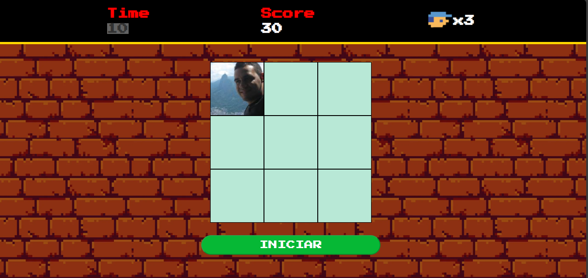

# Detona Ralf

## Resumo

Detona Ralf é um jogo de quebra-cabeça para dois jogadores. O objetivo do jogo é derrotar a parede de tijolos maligna usando diferentes habilidades e itens.

## Regras

* O jogo é jogado em uma tela dividida horizontalmente. Cada jogador controla um personagem, Ralf ou Vanellope.
* Os personagens podem se mover para a esquerda, para a direita, para cima e para baixo.
* Os personagens podem usar itens para interagir com o ambiente.
* A parede de tijolos maligna é a principal ameaça do jogo. Ela pode atacar os personagens com lasers e projéteis.

## Habilidades e itens

* **Ralf:** Ralf pode usar seu martelo para quebrar tijolos. Ele também pode usar seu gancho para pegar itens e se mover para cima.
 
* **Vanellope:** Vanellope pode usar sua habilidade de correr para se mover mais rápido. Ela também pode usar seu poder de teletransporte para se mover para qualquer lugar na tela.
[Image of Vanellope, o personagem do jogo Detona Ralf]

## Objetos

* **Tijolos:** Os tijolos podem ser quebrados com o martelo de Ralf ou com a habilidade de correr de Vanellope.
* **Chaves:** As chaves abrem portas que levam a novos níveis.
* **Moedas:** As moedas podem ser coletadas para ganhar pontos.

## Vencedor

O jogador que derrotar a parede de tijolos maligna primeiro vence o jogo.

## Dicas

* Use as habilidades e itens dos personagens para sua vantagem.
* Não deixe que a parede de tijolos maligna o atinja.
* Colete moedas para ganhar pontos e aumentar sua pontuação final.
